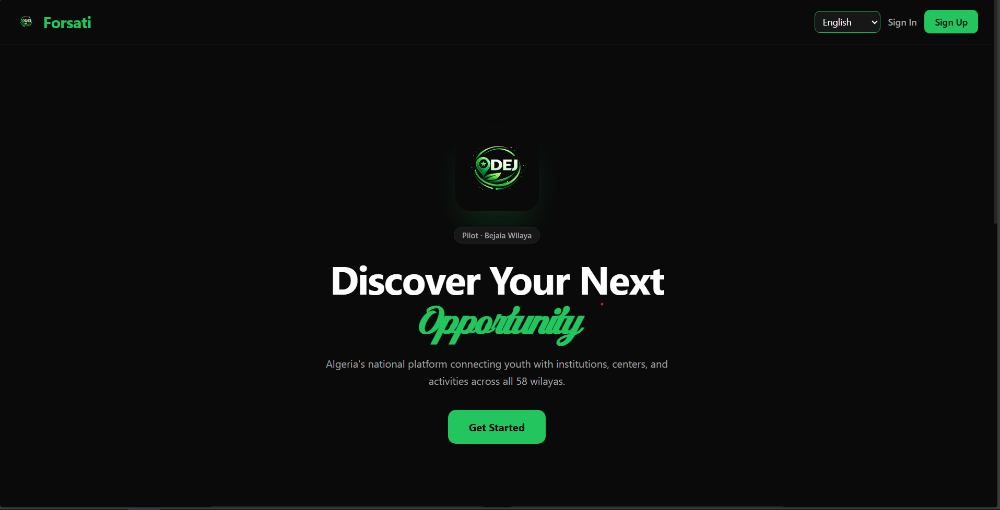
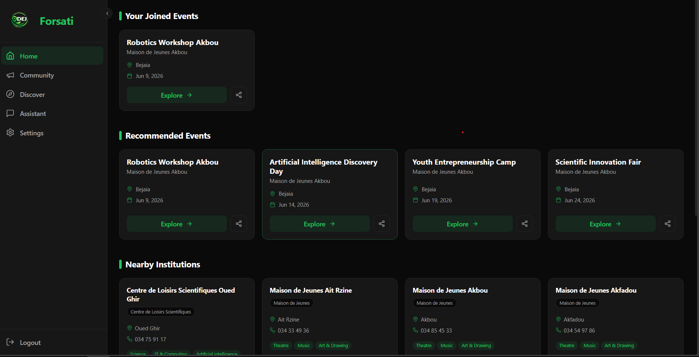
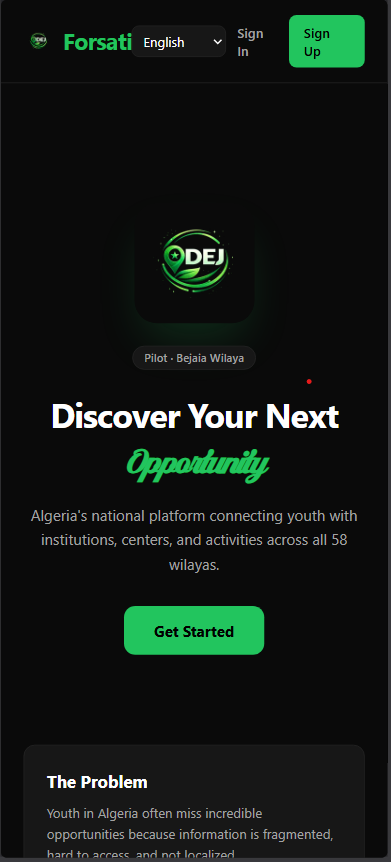
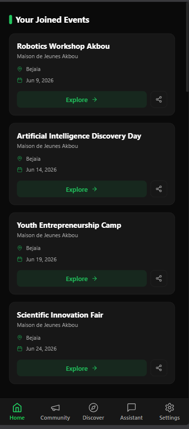
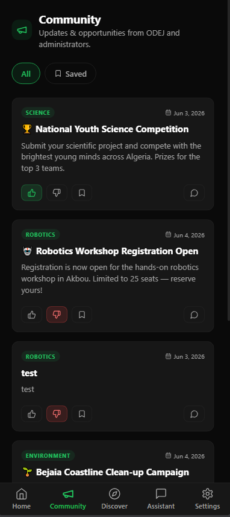
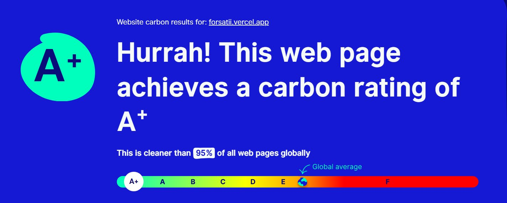

<div align="center">

<!-- Animated Header Banner: black → green gradient waves with twinkling animation -->


<!-- App Logo & ODEJ Logo — transparent, side by side -->
<p align="center">
  
  &nbsp;&nbsp;&nbsp;&nbsp;&nbsp;&nbsp;
  
</p>

**A personalized youth-opportunity discovery platform connecting young Algerians to ODEJ youth establishments.**

🏆 **Proudly Built for EcoHack Chellata by SUDOTeam** 🏆

<br />

### 🚀 <a href="https://forsatii.vercel.app/" target="_blank" rel="noopener noreferrer">Experience FORSATI Live Here</a> 🚀

<br />

<!-- Clickable Badges (open in new tab) -->
<a href="https://nextjs.org/" target="_blank" rel="noopener noreferrer"></a>
<a href="https://www.typescriptlang.org/" target="_blank" rel="noopener noreferrer"></a>
<a href="https://tailwindcss.com/" target="_blank" rel="noopener noreferrer"></a>
<a href="https://firebase.google.com/" target="_blank" rel="noopener noreferrer"></a>
<a href="https://opensource.org/licenses/MIT" target="_blank" rel="noopener noreferrer"></a>
<a href="https://www.websitecarbon.com/website/forsatii-vercel-app/" target="_blank" rel="noopener noreferrer"></a>

[Explore Features](#✨-features) • [Gallery](#📸-app-gallery) • [Low Carbon](#-a-low-carbon-website--by-design) • [Getting Started](#📦-getting-started) • [Tech Stack](#🧱-tech-stack) • [Contact](#-contact--follow-the-developers)

</div>

---

## 🧠 The Vision

> *Young people don't lack opportunities — they lack a simple, centralized way to reach them.*

**FORSATI** (from the Arabic فرصتي — *"my opportunity"*) is a premium, mobile-first web application designed to bring youth opportunities offered by ODEJ (youth houses, sports complexes, science centers, hostels, and camps) into a single, accessible hub.

By utilizing a deterministic recommendation engine (matching interests with location), FORSATI connects youth with the right institutions, allows seamless event registration with **QR-coded ticketing**, and breaks language barriers by offering full support in **4 languages (including Kabyle and RTL Arabic)**.

---

## 📸 App Gallery

### 💻 Desktop Experience
<div align="center">
  
  <br/>
  
</div>

<br/>

### 📱 Mobile-First Design
<div align="center">
  <table>
    <tr>
      <td align="center"><b>Landing & Onboarding</b></td>
      <td align="center"><b>Personalized Feed</b></td>
      <td align="center"><b>Community & Settings</b></td>
    </tr>
    <tr>
      <td></td>
      <td></td>
      <td></td>
    </tr>
  </table>
</div>

---

## ✨ Features

We built FORSATI to be feature-rich yet incredibly lightweight.

| Feature | Description |
| :--- | :--- |
| 🧭 **Discover Feed** | Personalized institution & opportunity recommendations based on your exact interests and Wilaya. |
| 🤖 **Smart Assistant** | Ask in natural words (*"sport in Akbou"*). Matched against the real ODEJ dataset with **zero hallucination**. |
| 🎟️ **Events & QR Tickets** | Dynamic registration forms that generate a unique QR ticket for every participant. |
| 📷 **QR Check-in** | Admin dashboard with a built-in scanner to confirm real-time attendance on-site. |
| 🏛️ **Institutions Browser**| Explore ODEJ youth establishments with deep details, categories, and direct contact info. |
| 💬 **Community Feed** | A built-in social feed for sharing, networking, and discussion among local youth. |
| 🌍 **Multilingual + RTL** | Seamlessly switch between **Arabic, French, English, and Kabyle (kab)** with flawless RTL support. |
| 🚀 **Smart Onboarding** | Frictionless profile setup that powers our recommendation engine instantly. |

---

## 🌱 Efficiency by Design

FORSATI is light on purpose. This isn't just a claim; it's a series of strict engineering decisions:

*   🧮 **Zero-AI Recommendation Engine:** `lib/recommend.ts` is a pure scoring function (interests × wilaya). No heavy models, no expensive API calls. It runs locally in **~1 ms**.
*   🔎 **Local Dataset Search:** The assistant reads a bundled JSON dataset. Answers come from *real* ODEJ data—it is mathematically impossible to hallucinate.
*   🔥 **Targeted Firestore `where()` Queries:** We never fetch entire collections. Every read is filtered **server-side** with Firestore's `where()` clauses (e.g. `where("wilaya", "==", "06")`, `where("category", "==", "sport")`), so only the documents the user actually needs travel over the network. Fewer document reads = lower bandwidth, faster screens, lower Firebase costs, and a smaller carbon footprint.
*   🌑 **Dark-first UI:** A sleek `#0a0a0a` default theme with `#22c55e` accents. OLED-friendly, battery-saving, and stunning.
*   🪶 **Lightweight Stack:** Powered by `lucide-react` icons and minimal animations to avoid UI framework bloat.
*   🖼️ **Next.js Edge Optimization:** Images and assets are served efficiently out-of-the-box.

---

## 🌍 A+ Low-Carbon Website — By Design

All of those engineering decisions add up to something measurable. FORSATI was independently tested by <a href="https://www.websitecarbon.com/website/forsatii-vercel-app/" target="_blank" rel="noopener noreferrer"><b>Website Carbon Calculator</b></a> and earned the highest possible rating:

<div align="center">



### 🏅 Carbon Rating: **A+** — Cleaner than **95%** of all web pages globally

🔗 <b>Verify it yourself:</b> <a href="https://www.websitecarbon.com/website/forsatii-vercel-app/" target="_blank" rel="noopener noreferrer">websitecarbon.com/website/forsatii-vercel-app</a>

</div>

This matters because the web has a real environmental cost: every byte transferred consumes energy across data centers, networks, and devices. By shipping a minimal bundle, filtering data at the source with Firestore `where()` queries, and defaulting to an OLED-friendly dark theme, FORSATI sits in the **top 5% of the entire web** for energy efficiency — a perfect fit for a project born at **EcoHack** 🌱.

---

## 🧱 Tech Stack

<div align="center">
  <a href="https://nextjs.org/" target="_blank" rel="noopener noreferrer"></a>
  <a href="https://www.typescriptlang.org/" target="_blank" rel="noopener noreferrer"></a>
  <a href="https://react.dev/" target="_blank" rel="noopener noreferrer"></a>
  <a href="https://tailwindcss.com/" target="_blank" rel="noopener noreferrer"></a>
  <a href="https://firebase.google.com/" target="_blank" rel="noopener noreferrer"></a>
  <a href="https://git-scm.com/" target="_blank" rel="noopener noreferrer"></a>
</div>

<br>

| Layer | Technology Used |
| :--- | :--- |
| **Framework** | Next.js 14 (App Router) |
| **Language** | TypeScript, React 18 |
| **Styling** | Tailwind CSS (Custom Dark/Green Theme) |
| **Auth & DB**| Firebase Auth (Email/Google) & Cloud Firestore (with server-side `where()` filtering) |
| **QR Tech** | `html5-qrcode` (Scanner) / `qrcode.react` (Ticketing) |
| **Dataset** | `odej_bejaia_dataset.json` (68 Establishments) |

---

## 📦 Getting Started

### Prerequisites
* **Node.js 18+**
* A Firebase Project (with Authentication & Firestore enabled)

### Installation

**1. Clone the repository**
```bash
git clone https://github.com/SUDOTeam/forsati.git
cd forsati
```

**2. Install dependencies**
```bash
npm install
```

**3. Set up environment variables**

Create a `.env.local` file at the root of the project:
```env
NEXT_PUBLIC_FIREBASE_API_KEY=your_api_key
NEXT_PUBLIC_FIREBASE_AUTH_DOMAIN=your_auth_domain
NEXT_PUBLIC_FIREBASE_PROJECT_ID=your_project_id
NEXT_PUBLIC_FIREBASE_STORAGE_BUCKET=your_storage_bucket
NEXT_PUBLIC_FIREBASE_MESSAGING_SENDER_ID=your_messaging_id
NEXT_PUBLIC_FIREBASE_APP_ID=your_app_id
NEXT_PUBLIC_SITE_URL=http://localhost:3000
```

**4. Seed the Database (One-time setup)**

Deploy your Firestore rules (`firestore.rules`), start the dev server, and visit `http://localhost:3000/seed` once to securely load the ODEJ Béjaïa dataset into your Firestore.

**5. Launch the App**
```bash
npm run dev
```

Open <a href="http://localhost:3000" target="_blank" rel="noopener noreferrer">http://localhost:3000</a> to see the app in action 🚀.

---

## 🗂️ Project Architecture

<details>
<summary><b>Click to expand folder structure</b></summary>

```text
forsati/
├── app/
│   ├── (app)/            # discover · events · institutions · community · dashboard · assistant
│   ├── (admin)/          # admin dashboard + QR scanner
│   ├── (auth)/           # sign-in · sign-up · forgot-password
│   ├── api/assistant/    # keyword-search endpoint over the ODEJ dataset
│   ├── seed/             # one-time loader for the ODEJ dataset
│   ├── layout.tsx        # root layout + providers
│   └── page.tsx          # landing page
├── components/           # UI Components (Cards, Modals, Forms, Navbars)
├── lib/
│   ├── firebase.ts       # Firebase config
│   ├── recommend.ts      # Deterministic recommendation engine (no AI)
│   ├── contexts/         # AuthContext · LanguageContext (i18n + RTL)
│   └── translations/     # ar · fr · en · kab
├── odej_bejaia_dataset.json   # 68 ODEJ youth establishments (Béjaïa)
└── tailwind.config.ts
```

</details>

---

## 🗺️ Roadmap & Data

**The Dataset:**

Powered by `odej_bejaia_dataset.json` — featuring **68 real youth establishments** across the wilaya of Béjaïa (06), strictly organized into Maisons de Jeunes, Sports Complexes, Science Centers, and Hostels/Camps.

*(Note: Data sourced from public ODEJ Béjaïa listings. Verify before prod).*

**Future Updates:**

- 🗺️ **National Scale:** Expand dataset to cover all 58 Algerian wilayas.
- 📍 **Interactive Maps:** Geocode institutions at the commune level.
- 📅 **Admin Event Feed:** Structured event feed populated directly from the ODEJ dashboard.
- 📴 **Offline Mode:** PWA support with rich push notifications.
- 📱 **Native Mobile:** Port to React Native / Expo.

---

## 👥 Meet the Team

<div align="center">

<b>Built with 💚 by SUDOTeam at EcoHack Chellata</b>

<br/>

👨‍💻 Adam Mila &nbsp;·&nbsp; 👨‍💻 Syphax Ait Kheddache &nbsp;·&nbsp; 👨‍💻 Mouhamed Amine Yata

</div>

---

## 📬 Contact — Follow the Developers

<div align="center">

Got a question, an idea, or want to collaborate? Reach out to us directly on Instagram:

<br/>

<a href="https://www.instagram.com/_adam_mila_?igsh=MTJ1em5kN3dneHlnNQ==" target="_blank" rel="noopener noreferrer"></a>
&nbsp;
<a href="https://www.instagram.com/syphax_aitkhe?igsh=eGQ1ZGR2cWFkdDJv" target="_blank" rel="noopener noreferrer"></a>
&nbsp;
<a href="https://www.instagram.com/prvtt_mo7aa?igsh=MWtzdnp1ZWZ5dTh6aw==" target="_blank" rel="noopener noreferrer"></a>

</div>

---

<div align="center">

<p>Released under the <a href="https://opensource.org/licenses/MIT" target="_blank" rel="noopener noreferrer">MIT License</a>.</p>

<b>FORSATI · فرصتي — Discover your opportunity.</b>

</div>

<!-- Animated Footer: matching black → green gradient waves -->

